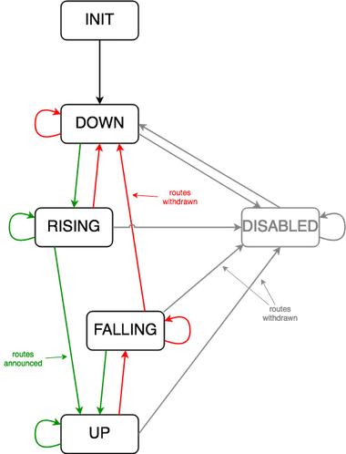

# ExaBGP Watchdog

## Introduction

This is a health watchdog that runs in conjunction with ExaBGP in order to advertise network prefixes via BGP.

## Synopsis

ExaBGP provides an ability to spawn a process which can then control the prefixes announced to peers.

The watchdog will conduct checks at a configured interval in order to determine whether the service is working correctly.

If the service is working correctly, then the service will rise and the prefix(es) will be announced.

If the service falls and goes down, then the prefix(es) will be withdrawn.

The number of concurrent tests that are required to pass in order for the service to be determined as "up" is configurable.

In the same way, the number of concurrent test failures that are required before the service is determined as "down" is configurable.

The configuration is re-read at the start of each interval.

If the nature of tests to be carried out change, the tests will be altered without a restart needed.

If parameters relating to the announced prefixes change, such as, but not limited to local preference, for example. then the prefixes will be withdrawn and re-announced.

The watchdog requires multiple consecutive tests to pass in order for the state to transition from **DOWN** to **UP** and simillarly, to fail in order to transition from **UP** to **DOWN**. This mechanism is configurable, and exists to minimise the flapping of prefixes to BGP peers in the event of mis-behaving service.

## Checks

The IP to test is constructed from the prefix, with the last octet replaced by the index. The watchdog is written for the scenario of advertising a v4 /24 (and/or v6 /48), further, that if the service has both IPv4 and IPv6 preixes, the last part of the IP is the same. If the last part of the prefix is not 0, the index is not used, and the prefix is tested verbatim (if you're advertising IPv4 /32 for example). See the TODO section.

### AuthDNS

The AuthDNS checks each defined qname against each defined prefix.

If all combinations pass, the check is a pass, however as soon as any test fails, the remining tests for that service in that interval are abandoned and the check is determined to have failed.

If a test fails, the check set is determined to be a fail and the set exits.

The supplied qname is checked for the SOA record and the response is expected to be **RCODE** `NOERROR` with `AA` in the response header.

Optionally, this test can check the serial of the local zone against a primary and fail if the serials differ by more than a configurable limit.

### RecursiveDNS

Similarly to the AuthDNS check, this test will expect the server to recurse to find the result which will be checked against the expected result.

The qname and qtype for the test query are configurable. as is the value expected in the RDATA in the ANSWER section of the response.

### ForcedUp

This test will always return as successful, and so the service will be **UP** and prefixes announced, regardless.

### ForcedDown

This test will always return as fail, the service will be **DOWN** and no prefixes will be announced, regardless.

## States

### DOWN

The service is down.

Process listing output will show `EXABGP Watchdog <servicename> DOWN`

If the service has just transitioned to this state:

* The prefixes are withdrawn, if they were being announced
* The counts of consecutive passes (rising) and failures (falling) are reset to 0.
* Process listing output will show `EXABGP Watchdog <servicename> RISING->DOWN` or `EXABGP Watchdog <servicename> FALLING->DOWN`

Check failure results in the service remaining in the **DOWN** state.

Check pass results in the state transitioning to the **RISING** state.

### RISING

The service is rising.

Process listing output will show `EXABGP Watchdog <servicename> RISING X/Y` where X is the current rising count, and Y is the number of consecutive successful test intervals requried to reach the **UP** state.

If the service has just transitioned to this state:

* The count of consecutive check passes (service rising count), is reset to 1
* The amount of consecutive check failures (service falling count) is reset to 0.
* Process listing output will show `EXABGP Watchdog <servicename> DOWN->RISING X/Y`

Check pass results in the state remaining at **RISING**, but incrementing the counter of consecutive passes (service rising count), unless the number of consecutive check passes (rising) now equals the required number required to determine that the service is up (rise), in which case the service transitions to the **UP** state.

Check failure results in the service returning to the **DOWN** state.

### FALLING

The service is falling.

Process listing output will show `EXABGP Watchdog <servicename> FALLING X/Y` where X is the current falling count, and Y is the fall requried to reach up.

If the service has just transitioned to this state:

* The count of consecutive check failures (service falling count), is reset to 1
* The amount of consecutive check passes (service rising count) is reset to 0.
* Process listing output will show `EXABGP Watchdog <servicename> UP->FALLING X/Y`

Check failure results in the state remaining at **FALLING**, but incrementing the counter of consecutive failures (service falling count), unless the number of consecutive check failures (falling) now equals the required number required to determine that the service is down (fall), in which case the service transitions to the **DOWN** state.

Check pass results in the service returning to the **UP** state.

### UP

The service is up.

Process listing output will show `EXABGP Watchdog <servicename> UP`

If the service has just transitioned to this state:

* The prefixes are announced.
* The counts of consecutive passes (rising) and failures (falling) are reset to 0.
* Process listing output will show `EXABGP Watchdog <servicename> RISING->UP` or `EXABGP Watchdog <servicename> FALLING->UP`

Check pass results in the service remaining in the **UP** state.

Check failure results in the service transitioning to the **FALLING** state.

## DISABLED

The service is disabled.

Process listing output will show `EXABGP Watchdog <servicename> DISABLED`

At any time, if either the global disable file is found, or the disable file for the relevant service is found, the service transitions to the **DISABLED** state, and any announced prefixes are withdrawn.

In the **DISABLED** state, no checks are performed, and the presence of the disable files is re-checked at each interval.

### Diagram



## Installation

1. Install `exabgp` and required perl modules
2. Copy `exabgp-watchdog` to somewhere; `perl -c exabgp-watchdog` will tell you if you're missing any modules
3. Create a config file at `/usr/local/etc/exabgp-watchdog.yaml`
4. Use the included example of `exabgp.env` as a basis for configuring `exabgp`
5. Use the included example of `exabgp.conf` as an example of how to start/run the watchdog

## Configuration

### Main

The configuration file is re-read on each check interval, and if there are material changes to the announcements, such as local preference, next hop, or metric, the announcements are withdrawn and re-announced with the new parameters.

The config is re-read on each loop and so all parameters can be changed on the fly.

The configuration file is YAML formatted and has a number of levels.

* localpref - the local-preference that you want the prefixes to be advertised with. Will default to 100 if unset.
* metric - the multi exit discriminator value that you want the prefixes to be advertised with. Defaults to 100 if unset.
* nexthop.ip4 - the IPv4 next hop. Usually this would be your local IP. It'll default to your local IP if you set it to 'self'.
* nexthop.ip6 - the IPv6 next hop. Again, this is usually your local IP. It'll default to your local IP if you set it to 'self'.
* interval - How often you want the daemon to perform the main loop. The loop will pause for this long at the bottom of the loop. It does not calculate the difference between the loop time and this. Defaults to 2.
* rise - How many consecutive successful test loops are required to go from **DOWN** to **UP**. Defaults to 5 if unset.
* fall - How many consecutive test fail loops are required for the service to transition from **UP** to **DOWN**. Defaults to 3 if unset.
* timeout - How long should a test take to timeout if there's no response? Defaults to 2 seconds.
* port - the DNS port to test. Defaults to port 53 if unset.
* disable - the global file to disable all services. No default, but note that without this, you can't disable the server. Remember the config is re-read on each loop so you can add it or change it on the fly.
* community - this is a global community that is included in the announcement
* services - the sub tree for defining services
  * `<service name>` - this is the service name that you will reference in the exabgp process configuration (see example)
  * disable - a file for disabling this service
  * check - the subtree for checking this service
    * type - currently only supports authdns
    * index - for each prefix, the daemon will check this as the last octet. So, if you define a prefix of 192.0.2.0/24 and index 1, the test will be performed against 192.0.2.1
    * items - the items to check. for authdns, this is a list of qnames, for example, but different tests will define different parameters for the test.
  * prefixes - the prefixes to advertise if the tests are successful
    * ip4 - the ipv4 prefixes, one per line (see example)
    * ip6 - the ipv6 prefixes (as above, but IPv6)
  * nexthop.ip4 - service level override of the global setting, see above
  * nexthop.ip6 - service level override of the global setting, see above
  * localpref - service level override of the global setting, see above
  * metric  - service level override of the global setting, see above
  * rise - service level override of the global setting, see above
  * fall - service level override of the global setting, see above
  * interval - service level override of the global setting, see above
  * timeout - service level override of the global setting, see above
  * port - service level override of the global setting, see above

### Service Checks

#### Auth DNS

* authdns - Looks up the SOA for the defined qname
  * index - test level override of the IP last octet to test
  * checkmaster - yes or no - defines whether we should check the master for zone age as part of the test. defaults to no.
  (note that checking the master expects to get an authoritative response to a SOA query for the qname against the master)
  * maxage - the maximum serial difference - no default (TODO: set default or barf)
  * master - the master to check for this test
  * items
    * qname - the qname to test
    * master - a per qname override of the check level master server for this zone
    * maxage - a per qname override of the check level max age
    * index - item level override of the IP last octet to test

#### Recursive DNS

* recursivedns
  * index - test level override of the IP last octet to test
  * items
    * qname - the qname to test
    * qtype - the qtype to test, defaults to `A`
    * match - the value to match, defaults to `127.0.0.1`
    * index - item level override of the IP last octet to test

### Example Configuration

```
localpref: 100
metric: 100
nexthop.ip4: self
nexthop.ip6: self
interval: 3
rise: 5
fall: 2
timeout: 1
port: 53
disable: /tmp/disable-all
debug: 0
comminty: 65000:101
services:
  example:
    disable: /tmp/disable-example
    check:
      type: authdns
      index: 1
      items:
        - qname: example.com
        - qname: example.net
    prefixes:
      ip4:
        - 192.0.2.0/24
      ip6:
        - 2001:db8:1::/48
        - 2001:db8:2::/48
```

## Diagnostics

The service can be instructed to perform debug output to the logfile for a single pass of the check loop by sending the service PID signal USR1

The service can be instructed to dump the current state and config to `/tmp/exabgp-watchdog.<service name>.state` by sending the service PID signal USR2

The service will dump its current view of the configuration, service, and internal state upon receipt of signal USR2. The state file will be logged in the log file.

The system process list will display the state of each service:

```
11436 ? S 0:00 \_ EXABGP Watchdog example-v6 DOWN->RISING 1/5
11437 ? S 0:00 \_ EXABGP Watchdog example-v4 DOWN->RISING 1/5
```

...and later...

```
11436 ? S 0:00 \_ EXABGP Watchdog example-v6 RISING 4/5
11437 ? S 0:00 \_ EXABGP Watchdog example-v4 RISING 4/5
```

...and later...

```
11436 ? S 0:00 \_ EXABGP Watchdog example-v6 RISING->UP
11437 ? S 0:00 \_ EXABGP Watchdog example-v4 RISING->UP
```

...and later...

```
11436 ? S 0:00 \_ EXABGP Watchdog example-v6 UP
11437 ? S 0:00 \_ EXABGP Watchdog example-v4 UP
```

## Troubleshooting

This is an example snippet of the log file, and has been manually anonymised, so please shout if there are inconsistencies that generate questions!

The examples assume two services defined, `example-v4` and `example-v6` - although you could combine v4 and v6 prefixes within a single service definition.

First, we see the initialisation. The log displays the settings that the services are configured with. Note, that this server is running example-v4 and example-v6 services. All services are logged in the same log file, but are clearly marked.

```
Aug 17 14:34:47 somehost exabgp-watchdog[14368]: example-v4 :: INFO :: main :: Service is globally disabled by /tmp/disable-all
Aug 17 14:34:47 somehost exabgp-watchdog[14367]: example-v6 :: INFO :: main :: Service is globally disabled by /tmp/disable-all
Aug 17 14:34:47 somehost exabgp-watchdog[14367]: example-v6 :: INFO :: main :: the service is DISABLED (was DOWN)
Aug 17 14:34:47 somehost exabgp-watchdog[14368]: example-v4 :: INFO :: main :: the service is DISABLED (was DOWN)
Aug 17 14:34:47 somehost exabgp-watchdog[14367]: example-v6 :: INFO :: main :: STATE :: L:; C:DISABLED; P:DOWN; R:0/5; F:0/2; Tests F:0 P:0 T:0; Time L:; T:0.0000
Aug 17 14:34:47 somehost exabgp-watchdog[14368]: example-v4 :: INFO :: main :: STATE :: L:; C:DISABLED; P:DOWN; R:0/5; F:0/2; Tests F:0 P:0 T:0; Time L:; T:0.0000
Aug 17 14:34:47 somehost exabgp-watchdog[14367]: example-v6 :: INFO :: main :: localpref initialised to 100
Aug 17 14:34:47 somehost exabgp-watchdog[14368]: example-v4 :: INFO :: main :: localpref initialised to 100
Aug 17 14:34:47 somehost exabgp-watchdog[14367]: example-v6 :: INFO :: main :: nexthop.ip4 initialised to xxx.xxx.xxx.xxx
Aug 17 14:34:47 somehost exabgp-watchdog[14368]: example-v4 :: INFO :: main :: nexthop.ip4 initialised to xxx.xxx.xxx.xxx
Aug 17 14:34:47 somehost exabgp-watchdog[14367]: example-v6 :: INFO :: main :: nexthop.ip6 initialised to 2001:db8:444::1
Aug 17 14:34:47 somehost exabgp-watchdog[14368]: example-v4 :: INFO :: main :: nexthop.ip6 initialised to 2001:db8:444::1
Aug 17 14:34:47 somehost exabgp-watchdog[14367]: example-v6 :: INFO :: main :: metric initialised to 100
Aug 17 14:34:47 somehost exabgp-watchdog[14368]: example-v4 :: INFO :: main :: metric initialised to 100
Aug 17 14:34:47 somehost exabgp-watchdog[14367]: example-v6 :: INFO :: main :: service has been DISABLED, we need to withdraw
Aug 17 14:34:47 somehost exabgp-watchdog[14368]: example-v4 :: INFO :: main :: service has been DISABLED, we need to withdraw
```

Next, we can see the first loop. The services are both disabled by the global flag file being present.

```
Aug 17 14:34:50 somehost exabgp-watchdog[14368]: example-v4 :: INFO :: main :: Service is globally disabled by /tmp/disable-all
Aug 17 14:34:50 somehost exabgp-watchdog[14367]: example-v6 :: INFO :: main :: Service is globally disabled by /tmp/disable-all
Aug 17 14:34:50 somehost exabgp-watchdog[14368]: example-v4 :: INFO :: main :: the service is DISABLED (was DISABLED)
Aug 17 14:34:50 somehost exabgp-watchdog[14367]: example-v6 :: INFO :: main :: the service is DISABLED (was DISABLED)
Aug 17 14:34:50 somehost exabgp-watchdog[14368]: example-v4 :: INFO :: main :: STATE :: L:1; C:DISABLED; P:DISABLED; R:0/5; F:0/2; Tests F:0 P:0 T:0; Time L:0.1054; T:0.0000
Aug 17 14:34:50 somehost exabgp-watchdog[14367]: example-v6 :: INFO :: main :: STATE :: L:1; C:DISABLED; P:DISABLED; R:0/5; F:0/2; Tests F:0 P:0 T:0; Time L:0.1051; T:0.0000
```

We can see that the current state is DISABLED and that the state on the previous loop was also DISABLED.

Next, we can see loop 2, 3 seconds (the "interval") later:

```
Aug 17 14:34:53 somehost exabgp-watchdog[14368]: example-v4 :: INFO :: main :: Service is globally disabled by /tmp/disable-all
Aug 17 14:34:53 somehost exabgp-watchdog[14368]: example-v4 :: INFO :: main :: the service is DISABLED (was DISABLED)
Aug 17 14:34:53 somehost exabgp-watchdog[14367]: example-v6 :: INFO :: main :: Service is globally disabled by /tmp/disable-all
Aug 17 14:34:53 somehost exabgp-watchdog[14368]: example-v4 :: INFO :: main :: STATE :: L:2; C:DISABLED; P:DISABLED; R:0/5; F:0/2; Tests F:0 P:0 T:0; Time L:0.0171; T:0.0000
Aug 17 14:34:53 somehost exabgp-watchdog[14367]: example-v6 :: INFO :: main :: the service is DISABLED (was DISABLED)
Aug 17 14:34:53 somehost exabgp-watchdog[14367]: example-v6 :: INFO :: main :: STATE :: L:2; C:DISABLED; P:DISABLED; R:0/5; F:0/2; Tests F:0 P:0 T:0; Time L:0.0172; T:0.0000
Aug 17 16:17:14 somehost exabgp-watchdog[14368]: example-v4 :: INFO :: main :: the service is DISABLED (was DISABLED)
```

Next we can see that the service is enabled by the removal of the flag file, and the service toggles to the DOWN state, followed by toggling to the RISING state because the tests are passing. We can see that we have been rising for 1 loop of the required 5 before the service will be UP (`R:1/5`).

```
Aug 17 16:17:14 somehost exabgp-watchdog[14368]: example-v4 :: INFO :: main :: STATE :: L:2037; C:DISABLED; P:DISABLED; R:0/5; F:0/2; Tests F:0 P:0 T:0; Time L:0.0202; T:0.0000
Aug 17 16:17:16 somehost exabgp-watchdog[14367]: example-v6 :: INFO :: main :: Previously disabled service has been re-enabled
Aug 17 16:17:17 somehost exabgp-watchdog[14367]: example-v6 :: INFO :: main :: the service is changing state from DOWN to RISING
Aug 17 16:17:17 somehost exabgp-watchdog[14367]: example-v6 :: INFO :: main :: STATE :: L:2038; C:RISING; P:DISABLED; R:1/5; F:0/2; Tests F:0 P:9 T:9; Time L:0.0195; T:0.1285
Aug 17 16:17:17 somehost exabgp-watchdog[14368]: example-v4 :: INFO :: main :: Previously disabled service has been re-enabled
Aug 17 16:17:17 somehost exabgp-watchdog[14368]: example-v4 :: INFO :: main :: the service is changing state from DOWN to RISING
Aug 17 16:17:17 somehost exabgp-watchdog[14368]: example-v4 :: INFO :: main :: STATE :: L:2038; C:RISING; P:DISABLED; R:1/5; F:0/2; Tests F:0 P:18 T:18; Time L:0.0190; T:0.1013
Aug 17 16:17:20 somehost exabgp-watchdog[14367]: example-v6 :: INFO :: main :: STATE :: L:2039; C:RISING; P:RISING; R:2/5; F:0/2; Tests F:0 P:9 T:9; Time L:0.1486; T:0.0106
Aug 17 16:17:20 somehost exabgp-watchdog[14368]: example-v4 :: INFO :: main :: STATE :: L:2039; C:RISING; P:RISING; R:2/5; F:0/2; Tests F:0 P:18 T:18; Time L:0.1125; T:0.0205
Aug 17 16:17:23 somehost exabgp-watchdog[14367]: example-v6 :: INFO :: main :: STATE :: L:2040; C:RISING; P:RISING; R:3/5; F:0/2; Tests F:0 P:9 T:9; Time L:0.0274; T:0.0238
Aug 17 16:17:23 somehost exabgp-watchdog[14368]: example-v4 :: INFO :: main :: STATE :: L:2040; C:RISING; P:RISING; R:3/5; F:0/2; Tests F:0 P:18 T:18; Time L:0.0438; T:0.0387
Aug 17 16:17:26 somehost exabgp-watchdog[14367]: example-v6 :: INFO :: main :: STATE :: L:2041; C:RISING; P:RISING; R:4/5; F:0/2; Tests F:0 P:9 T:9; Time L:0.0428; T:0.0225
Aug 17 16:17:26 somehost exabgp-watchdog[14368]: example-v4 :: INFO :: main :: STATE :: L:2041; C:RISING; P:RISING; R:4/5; F:0/2; Tests F:0 P:18 T:18; Time L:0.0568; T:0.0372
```

Finally, we can see that the state toggles to **UP** from **RISING** when there have been 5 consecutive successful test loops.

```
Aug 17 16:17:29 somehost exabgp-watchdog[14367]: example-v6 :: INFO :: main :: the service is now UP
Aug 17 16:17:29 somehost exabgp-watchdog[14367]: example-v6 :: INFO :: main :: STATE :: L:2042; C:UP; P:RISING; R:0/5; F:0/2; Tests F:0 P:9 T:9; Time L:0.0403; T:0.0088
Aug 17 16:17:29 somehost exabgp-watchdog[14367]: example-v6 :: INFO :: main :: service must have just come up, so we need to announce
Aug 17 16:17:29 somehost exabgp-watchdog[14367]: example-v6 :: INFO :: main::announce :: announce route 2001:db8::/48 next-hop 2001:db8:444::1 local-preference 100 med 100
Aug 17 16:17:29 somehost exabgp-watchdog[14368]: example-v4 :: INFO :: main :: the service is now UP
Aug 17 16:17:29 somehost exabgp-watchdog[14368]: example-v4 :: INFO :: main :: STATE :: L:2042; C:UP; P:RISING; R:0/5; F:0/2; Tests F:0 P:18 T:18; Time L:0.0508; T:0.0407
Aug 17 16:17:29 somehost exabgp-watchdog[14368]: example-v4 :: INFO :: main :: service must have just come up, so we need to announce

The services determine that they need to announce the prefixes, and the announce subroutine determines that the prefixes are not already announced and therefore actually need to be announced.

Aug 17 16:17:29 somehost exabgp-watchdog[14368]: example-v4 :: INFO :: main::announce :: announce route 192.0.2.0/24 next-hop xxx.xxx.xxx.xxx local-preference 100 med 100
Aug 17 16:17:32 somehost exabgp-watchdog[14367]: example-v6 :: INFO :: main :: STATE :: L:2043; C:UP; P:UP; R:0/5; F:0/2; Tests F:0 P:9 T:9; Time L:0.0236; T:0.0120
Aug 17 16:17:32 somehost exabgp-watchdog[14368]: example-v4 :: INFO :: main :: STATE :: L:2043; C:UP; P:UP; R:0/5; F:0/2; Tests F:0 P:18 T:18; Time L:0.0526; T:0.0192
```

Now, we see that there is a problem - I stopped the DNS server so that the server would stop responding to DNS queries and so queries will timeout...

We can see that the services are both up (example-v4 and example-v6), until at 16:18:33 UTC, the test of the example.com zone for prefix 2001:db8::/48 by testing IP 2001:db8::1, has failed due to a timeout (basically, the server has stopped responding to DNS (I stopped the DNS server to force a failure)).

We can see that the state toggles from **UP** to **FALLING** and we can see that the falling count is F:1/2 which is indicating that there has been one failure, and two are needed for the service to be considered **DOWN**.

We can see that the tests continue to fail, and indeed, the service toggles from **FALLING** to **DOWN** at 16:18:37. At the same time, the service withdraws the prefixes associated with the service.

```
Aug 17 16:18:26 somehost exabgp-watchdog[14367]: example-v6 :: INFO :: main :: STATE :: L:2061; C:UP; P:UP; R:0/5; F:0/2; Tests F:0 P:9 T:9; Time L:0.0413; T:0.0162
Aug 17 16:18:27 somehost exabgp-watchdog[14368]: example-v4 :: INFO :: main :: STATE :: L:2061; C:UP; P:UP; R:0/5; F:0/2; Tests F:0 P:18 T:18; Time L:0.0525; T:0.0241
Aug 17 16:18:29 somehost exabgp-watchdog[14367]: example-v6 :: INFO :: main :: STATE :: L:2062; C:UP; P:UP; R:0/5; F:0/2; Tests F:0 P:9 T:9; Time L:0.0268; T:0.0149
Aug 17 16:18:30 somehost exabgp-watchdog[14368]: example-v4 :: INFO :: main :: STATE :: L:2062; C:UP; P:UP; R:0/5; F:0/2; Tests F:0 P:18 T:18; Time L:0.0409; T:0.0412
Aug 17 16:18:33 somehost exabgp-watchdog[14367]: example-v6 :: ERR :: main :: ip6 -> 2001:db8::/48 -> example.com -> 2001:db8::1 -> failed (1.0002), errorstring: timeout alarm
Aug 17 16:18:33 somehost exabgp-watchdog[14367]: example-v6 :: INFO :: main :: the service is changing state from UP to FALLING
Aug 17 16:18:33 somehost exabgp-watchdog[14367]: example-v6 :: INFO :: main :: STATE :: L:2063; C:FALLING; P:UP; R:0/5; F:1/2; Tests F:1 P:0 T:1; Time L:0.0356; T:1.0032
Aug 17 16:18:34 somehost exabgp-watchdog[14368]: example-v4 :: ERR :: main :: ip4 -> 192.0.2.0/24 -> example.com -> 192.0.2.1 -> failed (1.0001), errorstring: timeout alarm
Aug 17 16:18:34 somehost exabgp-watchdog[14368]: example-v4 :: INFO :: main :: the service is changing state from UP to FALLING
Aug 17 16:18:34 somehost exabgp-watchdog[14368]: example-v4 :: INFO :: main :: STATE :: L:2063; C:FALLING; P:UP; R:0/5; F:1/2; Tests F:1 P:0 T:1; Time L:0.0602; T:1.0008
Aug 17 16:18:37 somehost exabgp-watchdog[14367]: example-v6 :: ERR :: main :: ip6 -> 2001:db8::/48 -> example.com -> 2001:db8::1 -> failed (1.0003), errorstring: timeout alarm
Aug 17 16:18:37 somehost exabgp-watchdog[14367]: example-v6 :: INFO :: main :: the service is now DOWN
Aug 17 16:18:37 somehost exabgp-watchdog[14367]: example-v6 :: INFO :: main :: STATE :: L:2064; C:DOWN; P:FALLING; R:0/5; F:0/2; Tests F:1 P:0 T:1; Time L:1.0228; T:1.0010
Aug 17 16:18:37 somehost exabgp-watchdog[14367]: example-v6 :: INFO :: main :: service must have just gone down, so we need to withdraw
Aug 17 16:18:37 somehost exabgp-watchdog[14367]: example-v6 :: INFO :: main::withdraw :: withdraw route 2001:db8::/48 next-hop 2001:db8:444::1 local-preference 100 med 100
Aug 17 16:18:38 somehost exabgp-watchdog[14368]: example-v4 :: ERR :: main :: ip4 -> 192.0.2.0/24 -> example.com -> 192.0.2.1 -> failed (1.0001), errorstring: timeout alarm
Aug 17 16:18:38 somehost exabgp-watchdog[14368]: example-v4 :: INFO :: main :: the service is now DOWN
Aug 17 16:18:38 somehost exabgp-watchdog[14368]: example-v4 :: INFO :: main :: STATE :: L:2064; C:DOWN; P:FALLING; R:0/5; F:0/2; Tests F:1 P:0 T:1; Time L:1.0207; T:1.0005
Aug 17 16:18:38 somehost exabgp-watchdog[14368]: example-v4 :: INFO :: main :: service must have just gone down, so we need to withdraw
Aug 17 16:18:38 somehost exabgp-watchdog[14368]: example-v4 :: INFO :: main::withdraw :: withdraw route 192.0.2.0/24 next-hop xxx.xxx.xxx.xxx local-preference 100 med 100
Aug 17 16:18:43 somehost exabgp-watchdog[14367]: example-v6 :: ERR :: main :: ip6 -> 2001:db8::/48 -> example.com -> 2001:db8::1 -> failed (1.0005), errorstring: timeout alarm
Aug 17 16:18:43 somehost exabgp-watchdog[14367]: example-v6 :: INFO :: main :: STATE :: L:2065; C:DOWN; P:DOWN; R:0/5; F:0/2; Tests F:1 P:0 T:1; Time L:2.6771; T:1.0013
```

For completion, we can see that if dnsdist is restarted, and the server starts to respond to DNS queries again, the service comes back up, and the prefixes are once again announced.

```
Aug 17 16:18:58 somehost exabgp-watchdog[14367]: example-v6 :: INFO :: main :: the service is changing state from DOWN to RISING
Aug 17 16:18:58 somehost exabgp-watchdog[14367]: example-v6 :: INFO :: main :: STATE :: L:2069; C:RISING; P:DOWN; R:1/5; F:0/2; Tests F:0 P:9 T:9; Time L:1.0233; T:0.0103
Aug 17 16:18:58 somehost exabgp-watchdog[14368]: example-v4 :: INFO :: main :: the service is changing state from DOWN to RISING
Aug 17 16:18:58 somehost exabgp-watchdog[14368]: example-v4 :: INFO :: main :: STATE :: L:2069; C:RISING; P:DOWN; R:1/5; F:0/2; Tests F:0 P:18 T:18; Time L:1.0126; T:0.0208
Aug 17 16:19:01 somehost exabgp-watchdog[14367]: example-v6 :: INFO :: main :: STATE :: L:2070; C:RISING; P:RISING; R:2/5; F:0/2; Tests F:0 P:9 T:9; Time L:0.0217; T:0.0169
Aug 17 16:19:01 somehost exabgp-watchdog[14368]: example-v4 :: INFO :: main :: STATE :: L:2070; C:RISING; P:RISING; R:2/5; F:0/2; Tests F:0 P:18 T:18; Time L:0.0339; T:0.0210
Aug 17 16:19:04 somehost exabgp-watchdog[14367]: example-v6 :: INFO :: main :: STATE :: L:2071; C:RISING; P:RISING; R:3/5; F:0/2; Tests F:0 P:9 T:9; Time L:0.0274; T:0.0117
Aug 17 16:19:05 somehost exabgp-watchdog[14368]: example-v4 :: INFO :: main :: STATE :: L:2071; C:RISING; P:RISING; R:3/5; F:0/2; Tests F:0 P:18 T:18; Time L:0.0335; T:0.0195
Aug 17 16:19:07 somehost exabgp-watchdog[14367]: example-v6 :: INFO :: main :: STATE :: L:2072; C:RISING; P:RISING; R:4/5; F:0/2; Tests F:0 P:9 T:9; Time L:0.0234; T:0.0163
Aug 17 16:19:08 somehost exabgp-watchdog[14368]: example-v4 :: INFO :: main :: STATE :: L:2072; C:RISING; P:RISING; R:4/5; F:0/2; Tests F:0 P:18 T:18; Time L:0.0287; T:0.0207
Aug 17 16:19:10 somehost exabgp-watchdog[14367]: example-v6 :: INFO :: main :: the service is now UP
Aug 17 16:19:10 somehost exabgp-watchdog[14367]: example-v6 :: INFO :: main :: STATE :: L:2073; C:UP; P:RISING; R:0/5; F:0/2; Tests F:0 P:9 T:9; Time L:0.0346; T:0.0123
Aug 17 16:19:10 somehost exabgp-watchdog[14367]: example-v6 :: INFO :: main :: service must have just come up, so we need to announce
Aug 17 16:19:10 somehost exabgp-watchdog[14367]: example-v6 :: INFO :: main::announce :: announce route 2001:db8::/48 next-hop 2001:db8:444::1 local-preference 100 med 100
Aug 17 16:19:11 somehost exabgp-watchdog[14368]: example-v4 :: INFO :: main :: the service is now UP
Aug 17 16:19:11 somehost exabgp-watchdog[14368]: example-v4 :: INFO :: main :: STATE :: L:2073; C:UP; P:RISING; R:0/5; F:0/2; Tests F:0 P:18 T:18; Time L:0.0416; T:0.0216
Aug 17 16:19:11 somehost exabgp-watchdog[14368]: example-v4 :: INFO :: main :: service must have just come up, so we need to announce
Aug 17 16:19:11 somehost exabgp-watchdog[14368]: example-v4 :: INFO :: main::announce :: announce route 192.0.2.0/24 next-hop xxx.xxx.xxx.xxx local-preference 100 med 100
Aug 17 16:19:13 somehost exabgp-watchdog[14367]: example-v6 :: INFO :: main :: STATE :: L:2074; C:UP; P:UP; R:0/5; F:0/2; Tests F:0 P:9 T:9; Time L:0.0310; T:0.0110
Aug 17 16:19:14 somehost exabgp-watchdog[14368]: example-v4 :: INFO :: main :: STATE :: L:2074; C:UP; P:UP; R:0/5; F:0/2; Tests F:0 P:18 T:18; Time L:0.0412; T:0.0303
```


The `STATE` lines are printed to the log with each loop, and take the following format:

```
Aug 17 16:19:13 somehost exabgp-watchdog[14367]: example :: INFO :: main :: STATE :: L:2074; C:UP; P:UP; R:0/5; F:0/2; Tests F:0 P:9 T:9; Time L:0.0310; T:0.0110
```

- `Aug 17` ← the date
- `16:19:13` ← the time
- `somehost` ← the server name
- `exabgp-watchdog[14367]` ← the process name and PID
- `example` ← the exabgp-watchdog service being monitored
- `INFO` ← the log level (standard syslog log levels)
- `main` ← the subroutine in the code that is generating the log line
- `STATE` ← it's a status line
- `L:2074` ← the loop counter
- `C:UP` ← the current state of the service
- `P:UP` ← the state of the service on the previous loop
- `R:0/5` ← if we're rising, the number of consecutive loops that have had successful tests and the number required before we're "UP"
- `F:0/2` ← if we're falling, the number of consecutive loops that have failed tests and the number required before we're "DOWN"
- Tests
  - `F:0` ← the number of tests that failed
  - `P:9` ← the number of tests that passed
  - `T:9` ← the total number of tests
- Time
  - `L:0.0310` ← the time the last loop took
  - `T:0.0110` ← the amount of time the tests took to run

Other log lines have the following format, generally:

```
Aug 17 16:19:11 somehost exabgp-watchdog[14368]: example :: INFO :: main::announce :: announce route 192.0.2.0/24 next-hop xxx.xxx.xxx.xxx local-preference 100 med 100
```

- `Aug 17` ← the date
- `16:19:11` ← the time
- `somehost` ← the server name
- `exabgp-watchdog[14368]` ← the process name and PID
- `example` ← the exabgp-watchdog service name being monitored
- `INFO` ← the syslog level
- `main::announce` ← the subroutine logging the message
- `announce route 192.0.2.0/24 next-hop xxx.xxx.xxx.xxx local-preference 100 med 100` ← the message being logged. In this case, the message sent to exabgp, which in this case will announce route 192.0.2.0/24 to the BGP peer with a next hop of xxx.xxx.xxx.xxx (which is us, and should be our local IP!!) with a local-preference of 100 (which because this is eBGP, and local-preference is non-transitive, will not be announced to the peer) and with multi-exit discriminator of 100. 

## ToDo

* Make tests modular instead of embedded in the main watchdog code
* Consider alerting mechanism for service that toggles repeatedly between **UP** and **FALLING** without reaching **DOWN**
* IPv4 nameservers are constructed from prefix + index only if the prefix ends 0, but this treatment is not the same as for IPv6 addresses
* Consider modifying to cater testing for non 0 network boundary announcements
* Make the config file a CLI parameter
* Add per-prefix and/or per-service community support

## Bug Reporting

Please use the issues feature, or, of course, offer to contribute.

## Licence and Copyright

This code is Copyright (c) 2024 Karl Dyson.

All rights reserved.

## Warranty

There's no warranty that this code is safe, secure, or fit for any purpose.

I'm not responsible if you don't read the code, check its suitability for your
use case, and wake up to find it's eaten your cat...